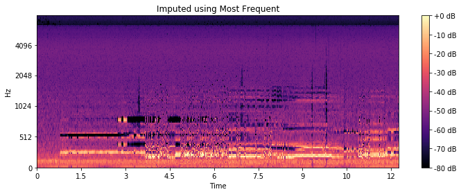
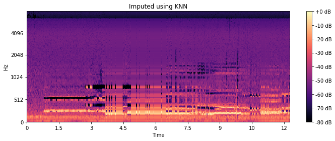
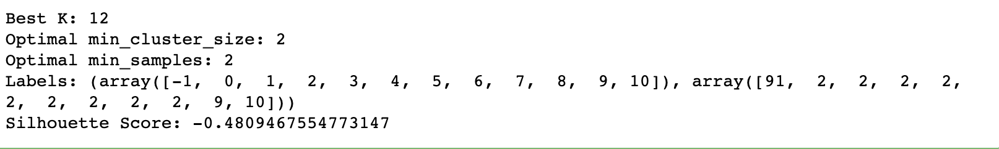
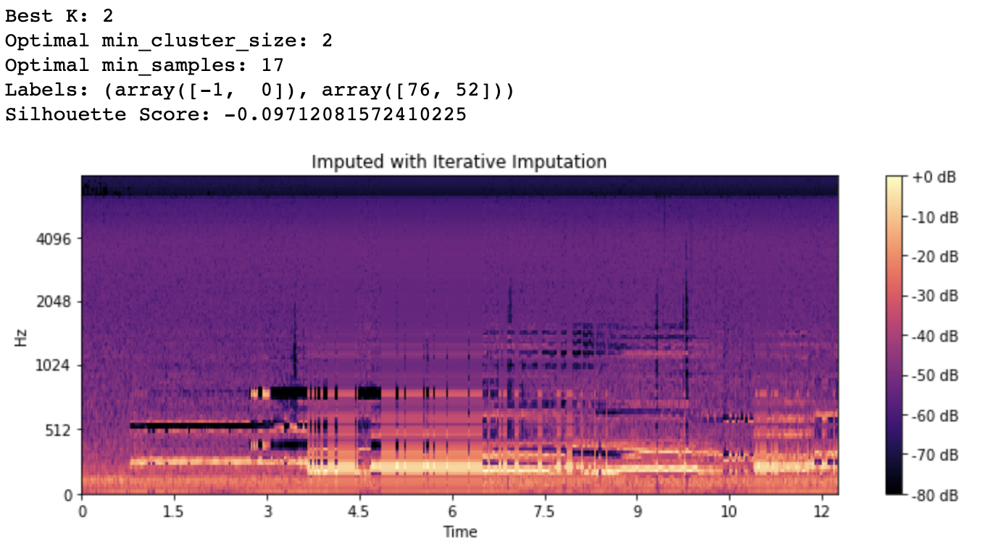
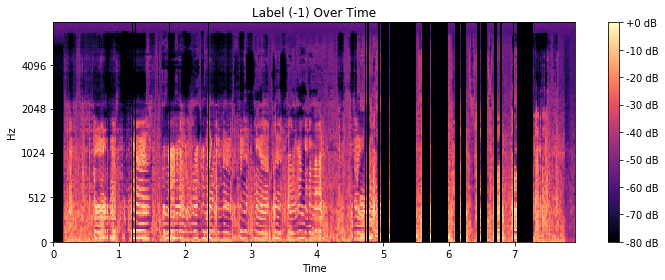

# Machine Learning Engineer Nanodegree
## Capstone Project
Carlos Rodriguez
July 22nd, 2019

## I. Definition
_(approx. 1-2 pages)_

### Project Overview

Today, unearthing a rare audio archive can be as simple as accessing a popular video sharing platform from a device that fits in your pocket. Alternatively, the fidelity of these aging recordings seemingly remains frozen in the time in which they were captured. Often, important (and even critical) portions of these recordings are unintelligible and are lost to history.

The goal of this capstone is to experiment with using [imputation](https://en.wikipedia.org/wiki/Imputation_(statistics)) algorithms to restore portions of audio content that were recorded poorly or were lost due to degradation.

The occurrence of missing data is not uncommon in machine learning. Methods for imputation have been explored in-depth and for various applications including [medical domains](https://www.ncbi.nlm.nih.gov/pmc/articles/PMC4959387/).

Matrix imputation has been applied to audio applications specifically in an attempt to impute missing values in the spectrogram as noted in this [research](https://ethman.github.io/063_1570360326.pdf) done by students at Northwestern University.

### Problem Statement

Restoring or repairing audio is challenging for many reasons. There are some inherent challenges working with damaged audio including but not limited to:

- Isolation of the desired source signal
- Identifying and removing noise
- Partial or complete loss of data during recording or due to degradation

Restoring lost audio data is particularly problematic because the audio is generally not missing from the signal, but unintelligible for the listener. This solution would treat unintelligible audio as anomalous and explicitly encode those data points as missing data (null values). An imputation algorithm would then replace the missing data with a plausible replacement similar to its neighbors.

### Metrics

A silhouette score will be used to analyze the repaired audio. The silhouette value is a measure of how similar an object is to its own cluster (cohesion) compared to other clusters (separation). The silhouette ranges from −1 to +1, where a high value indicates that the object is well matched to its own cluster and poorly matched to neighboring clusters.

A mean silhouette coefficient over all samples that is closer to `+1` is valuable because it should indicate that the repaired audio has clearly defined clusters representing only the desired audio (e.g., a voice) and some naturally occurring background noise (e.g, the acoustics of a room).

## II. Analysis
_(approx. 2-4 pages)_

### Data Exploration

Each audio sample selected includes one or more sections of perceived damaged audio. For the purposed of this analysis, "damage" is understood as audio perceived as anything other than speech or naturally occurring ambient sound (e.g, rustling, pops, static).

The inputs for this analysis are loaded from Wav formatted audio files and are initially represented as a floating point time series. The `sr` parameter is explicitly set to `None`, in order to preserve the native sampling rate. Also, duration is normalized between the damaged and repaired samples to produce identical input size and shape.

```
librosa.load(wav_path, sr=None, duration=duration) # preserve native sampling rate
```

Subsequently, features are extracted leveraging a computed mel-scaled spectrogram.

```
librosa.feature.melspectrogram(y=y, sr=sr)
```

The Mel scale is a perceptual scale of pitches judged by listeners to be equal in distance from one another [1]. Mel was chosen for two reasons. The first, is that the goal is to isolate and replace human perceived damaged portions of audio. The second reason is more technical. Librosa's implementation of the mel-scale features also includes an inverse transformation from features back to audio. Including a sonification with the overall analysis of the solution allows for a demonstrative “evaluation by ear”, albeit subjective.

```
librosa.feature.inverse.mel_to_audio(M, sr=sr, length=len(original)
```


### Exploratory Visualization

The first sample selected for analysis is of human vocals mixed with various distortion. A side-by-side mel-spectral visualization of the selected pair of inputs further suggests the auditory perceived damaged. The areas in bright yellow represent speech and are vividly defined in the ground truth sample. Whereas, the damaged sample is not as vivid and peaks of sound are clearly present in windows of time that should be silent (dark purple), as apparent in the ground truth example.

**Fig. 1** A side-by-side comparison of mel spectograms from the damaged and repaired samples respectively


Of course, in a real world application, a repaired sample would not be available to these types of comparisons. A more objective analysis would include defining a *damaged* window of time as a statistical anomaly. Of course, this approach depends on the assumption that the sample has enough [perceived] normal audio to establish a baseline for comparison from within the sample itself.

In order to establish a baseline for the perceived normal audio, we'll look more closely as the mel features extracted from the samples. First applying applying a simple technique [2] to isolate the more pertinent auditory data.

**Fig. 2** Separation of background and foreground information from damaged sample


### Algorithms and Techniques

With the more important information isolated, we can now use that as input to a clustering algorithm that should help us help distinguish between normal and damaged data.

[Finding Clusters with HDBSCAN](https://hdbscan.readthedocs.io/en/latest/)

HDBSCAN is a recent algorithm developed by some of the same people who write the original DBSCAN paper. Their goal was to allow varying density clusters. The algorithm can picking our varying density clusters based on cluster stability[3]

Intuitively, the expectation is to find only a few clusters of varying densities. With HDBSCAN, we have granular control in defining the smallest grouping size that should be considered a cluster. We can set the `min_cluster_size` to the very minimum which should in turn, surface the maximum amount of clusters. If our intuition is correct, the output should yield only two or three clusters representing the primary signal, the damaged signal, and potentially some remaining ambient noise.


[Outlier Detection with GLOSH](https://hdbscan.readthedocs.io/en/latest/outlier_detection.html)

GLOSH supports a notion of local outliers. Meaning, it can detect outliers that may be noticeably different from points in its local region. Detecting local outliers could be important when damaged audio falls closely on the Mel-scale relative to normal audio. The solution should look to impute values for outliers first before moving on to any secondary clusters.

[K-Nearest Neighbors for Imputation](https://github.com/eltonlaw/impyute/blob/master/impyute/imputation/cs/fast_knn.py)

The KNN algorithm uses ‘feature similarity’ to predict the values of any new data points. A new point is assigned a value based on how closely it resembles the points in the neighborhood. [4]

This particular [implementation](https://github.com/eltonlaw/impyute/blob/master/impyute/imputation/cs/fast_knn.py) uses a basic mean to impute missing values initially. The complete is array is then used to construct a  [KDTree](https://docs.scipy.org/doc/scipy/reference/generated/scipy.spatial.KDTree.query.html). The KDTree is queried returning distances to the nearest neighbors. Missing values are assigned using the weighted average of `k` nearest neighbors [5]


### Benchmark

The benchmark model was be produced using a simple *frequent value* imputation strategy. Missing values were replaced naively using the most frequent value of each column in which the missing values were located.

The resulting imputed array produced a silhouette score of ~`-0.5`.

|  | Silhouette Score | Optimal Clusters |
|-----|-----|-----|
| **Damaged** |`0.4332`| 3 
| **Ground Truth** | `0.5319` | 3
| **Benchmark** | `-0.5472` | 3

Of course, the benchmark is only as good as the clustering analysis and outlier detection used to identify values that were to be imputed. Simply using a cross-sectional imputation of approach to re-value outliers (without any optimization to outlier detection) introduced a lot of noise and produced poorer clusters definition than the original damaged sample.


## III. Methodology
_(approx. 3-5 pages)_

### Data Preprocessing

Before performing any meaningful analysis of this data, various pre-processing steps were applied (`Pre-Processing` notebook).

**Normalized damaged and ground-truth inputs respectively for waveform length and array size**

  - Visual trimming of the waveforms with Audacity software to guarantee identical starting and stopping points

  - Explicitly setting a normalized duration when loading the wav files into memory to guarantee identical input array size

**Applied a background noise filter to spectral input effectively to separate out data points with less perceived auditory value**

  - filtering by nearest neighbors

  - applying the filter as a soft-mask

  - multiply the mask by the input spectrum to separate input into foreground and background components

### Implementation

Implementation can be described in a few stages:

**Finding Clusters**

Before attempting to identify anomalous data in the damaged sample, we can leverage the ground-truth sample to establish expectations for normal clustering and outliers.

As a benchmark for clustering, partitions were first established with Kmeans. A custom search function (`search_param`) was utilized to find the optimal value for `k` with the expectation that the repaired sample should only produce `2` well-defined clusters with a silhouette score closer to one.

**Fig. 4** Results of ground-truth clustering with k-means 


**Outlier Detection**

As described above the GLOSH algorithm was utilized to calculate outlier scores for ground-truth. Scoring was included as part of an implementation of HDBSCAN. The larger the score the more outlier-like the point.[6] A visualization of the scoring was used as an aide in determining the a threshold for outliers.

**Fig. 5** Results of ground-truth outlier detection with GLOSH


Suprisingly, in applying clustering with HDBSCAN, it became apparent that the two algorithms produced very different results. 

*Fig. 6: Clusters defined with HDBSCAN*


*Fig. 7: Clusters defined with K-Means*


Clustering with HDBSCAN did infact define clusters with varying density, but did not score as well. Assuming that silhouette score (measuring cohesion and likeness) is suitable metric to compare across the two algorithms, K-means appeared to have outperformed its more recent counterpart. not globular thing

**Fig. 8** HDBSCAN Silhouette Score
 


Two unique concerns arose after clustering with HDBSCAN and detecting outliers with GLOSH. 

1. An identical amount of outliers were identified between the two damaged and ground-truth samples.
2. It became apparent that the time-steps where outliers were detected did not include the auditory anomalies we were looking for. 

**Fig. 9** Time-steps containing outliers


As a result, I would look at two possible remedies. 

1. Evaluating the imputation of secondary clusters instead of outliers
2. Utilizing a different set of auditory features

A visualization of the smaller cluster (-1 label) over time seem to align more cleanly with the time-steps that need repair. This could be an indication that this particular cluster was a better representation of time-steps that included auditory damage. Since I don't have a mathmetical way of mapping data points within clusters directly to auditory damage, I experimented with imputation of any secondary clusters, expecting that the sparser clusters were more likely to contain the time-steps with auditory damage.

**Fig. 10** Time-steps belonging to cluster with label of `-1` 


**Imputation**

In order to intentionally create missing data to be imputed, a value of `None` was assigned to any/all values found in the chosen cluster.

Once the values were reassigned, I leveraged the [impyute](https://impyute.readthedocs.io/en/master/) library to perform a cross-sectional imputation setting the mode to **most frequent**. This mode would substitute missing values with the mode of that column(most frequent) and in the case that there is a tie (there are multiple, most frequent values) for a column randomly pick one of them. [7]

**Fig. 11** Spectrogram of repaired sample using "Most Frequent"



With a benchmark established for imputation, I moved on to imputation with KNN (as described previously).

**Fig. 12** Spectrogram of repaired sample using KNN 



Finally, the resulting imputed data was again clustered after searching for optimal K and a final score is derived again using silhouette score. 

### Refinement

An optimal clustering of our final repaired sample produced a silhouette score of `-0.480` which was at least nominally improved from the benchmark, but not very good overall. I've reached several conclusions as to why but at minimum, I wanted to explore improving the performance of the imputation algorithm itself.

To do so, I looked first at parameter tuning that might improve the querying of the underlying KDTree.

The following adujstments were applied:

1. Increasing the search distance around points
2. Increasing the number of neighbors to return

Adjustments to these parameters had very little effect on the resulting silhouette score.

**Fig. 13** S-Score after adjustments



Tuning the imputation resulted in no improvement possibly due to the lack of and normal data surrounding the time-steps identified during clustering. In other words, the clusters we chose to impute might have represented too much of our sample to succesfully impute with information from its neighbors.

Apart from KNN, the most succesful imputer by far was the MICE algorithm (Multivariate Imputation by Chained Equations). MICE uses a chained equation approach to perform multiple imputations across the different variables. 

Since the mel-scale produces 128 unique features, an algorithm optimized for multivariate imputation was better suited for task.

With this in mind, I discovered another iterative and multivariate optimized experimental algorithm from sklearn implemented in the IterativeImputer class. This approach models each feature with missing values as a function of other features, and uses that estimate for imputation. It does so in an iterative fashion, and then is repeated for `max_iter` imputation rounds. The results of the final imputation round are returned. [8]


## IV. Results
_(approx. 2-3 pages)_

### Model Evaluation and Validation

Ultimately, the multivariate imputation using a round-robin approach produced the most improved results.

**Fig. 13** Results from iterative imputation



Processing a brand new input yielded very similar results and scores, but ultimately the solution fails in that statistical differences in time-steps do not directly correlate to auditory differences when interpreting audio with Mel features.

Our solution is repeatable and dependable in its imputation of data. The solution can generally find and replace clusters across various inputs albeit replacing valuable auditory data unnecessarily.


### Justification

Although the final results are significantly better than our benchmark, our metric is only valuable in measuring the statistical closeness of our reconstructed data.

|  | Silhouette Score | Optimal Clusters |
|-----|-----|-----|
| **Damaged** |`0.4332`| 3 
| **Ground Truth** | `0.5319` | 3
| **Benchmark** | `-0.5472` | 3
| **Final Solution** | `-0.0971` | 2

The problem goes unsolved in that a direct quantitative connection could not be established between statistical similarity and auditory similarity.  


## V. Conclusion

### Free-Form Visualization

The most compelling evidence that our clustering with Mel features was not finding auditory anomalies or damage is apparent in the spectrograms below. I used a zero-constant imputation to visualize time steps that would be imputed. 

**Fig. 14** Failing to find auditory damage

 
 
The unatural vertical stripes in **Fig. 14** represent the time steps that would be imputed across all of their respective features. Between ~5 and 7 seconds, one can see where the auditory damage is present.

**Fig. 15** Clusters over time

 
 
The smaller of the two most largest clusters **(Fig 15)** only indirectly found some of the auditory damage, but those results were not repeatable with other inputs.

**Fig. 16** Alternate Input - Clusters over time
 
 
In **Fig. 16**, our clustering fails to partition the damaged audio that occurs before the five second mark.  


### Reflection

The success of this methodology ultimately depends on the following:

1. An input that has sufficient *normal* audio to provide to the estimator 
1. Feature engineering resulting in a more accurate representation of auditory changes over time
2. Clustering that accurately partitions auditory differences
3. Mutltivariate imputation that is computationally efficient with high accuracy
4. Validation against various inputs that include a variety of auditory damage

Apart from uncovering a methodology that could work in the real-world, there were also some complexities with engineering the solution.

1. Feature selection (for the sake of time) was limited to implementations that included methods for inversing spectral representation back to time-series audio.
2. Since a ground-truth sample would not be available in the wild, I could not leverage any programmatic comparisons to ground-truth. For example, an intersection of the two samples would have been useful in isolating windows of auditory damage.   


### Improvement

Overall, I do think this approach could yield real-world results if it the solution could establish a direct quantitative relationship between statistical similarity and auditory similarity. 

To find that link, I might start by experimenting with a different feature set. Our selected features did not seem to sufficiently define the characteristics that represent normal audio (speech in this case). It's possible that an auditory abnormality is in fact too similar (on the mel-scale) to speech for a clusterer to distinguish in a repeatable fasion. 

For example, MFCC (Mel-frequency cepstral coefficients) frequency bands are equally spaced on the mel scale and approximate the human auditory system's response more closely[9].

Secondly, I'd look at a more precise imputation strategy with deep learning. I would expect a deep learning approach would exponentially improve upon the success of the iterative multivariate imputation. A study focused on the imputation of genomic data showed some success with a denoising autoencoder with partial loss (DAPL) as described in this [paper](https://www.biorxiv.org/content/10.1101/406066v2). 

> "A denoising autoencoder (DAE) aims to recover the noise-free, original input through
deep networks given a noisy input (Vincent, et al., 2008). In each iteration of training, noise is
added to the input X to obtain X hat. The loss is computed between the original X and the
reconstructed X hat). 

> Denoising autoencoder with partial loss
When the added noise to DAE is in the form of masking noise, i.e., a random fraction of
the input is set to 0, the DAE can be trained to estimate missing values (Vincent, et al., 2010).
The 0s in the training data simulate the missing elements and the reconstructed noise-free data
will fill those positions with estimated values. " [10]

Lastly, I'd look to support the outcome with more validation metrics. For this project, I focused exlusively on the likeness of the data points and measuring that the imputed values fit neatly within their neighborhoods. I would also include a metric that measures the accuracy of the reconstruction.  

### References

1. https://en.wikipedia.org/wiki/Mel_scale
2. https://librosa.github.io/librosa/0.7.0/auto_examples/plot_vocal_separation.html
3. https://hdbscan.readthedocs.io/en/latest/
4. https://towardsdatascience.com/6-different-ways-to-compensate-for-missing-values-data-imputation-with-examples-6022d9ca0779
5. https://github.com/eltonlaw/impyute/blob/master/impyute/imputation/cs/fast_knn.py
6. https://hdbscan.readthedocs.io/en/latest/api.html
7. https://impyute.readthedocs.io/en/latest/_modules/impyute/imputation/cs/central_tendency.html#mode
8. https://scikit-learn.org/stable/modules/impute.html
9. https://en.wikipedia.org/wiki/Mel-frequency_cepstrum
10. https://www.biorxiv.org/content/10.1101/406066v2
