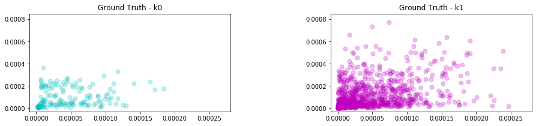
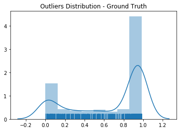

# Machine Learning Engineer Nanodegree
## Capstone Project
Carlos Rodriguez
July 22nd, 2019

## I. Definition
_(approx. 1-2 pages)_

### Project Overview

Today, unearthing a rare audio archive can be as simple as accessing a popular video sharing platform from a device that fits in your pocket. Alternatively, the fidelity of these aging recordings seemingly remains frozen in the time in which they were captured. Often, important (and even critical) portions of these recordings are unintelligible and are lost to history.

The goal of this capstone is to experiment with using [imputation](https://en.wikipedia.org/wiki/Imputation_(statistics)) algorithms to restore portions of audio content that were recorded poorly or were lost due to degradation.

The occurrence of missing data is not uncommon in machine learning. Methods for imputation have been explored in-depth and for various applications including [medical domains](https://www.ncbi.nlm.nih.gov/pmc/articles/PMC4959387/).

Matrix imputation has been applied to audio applications specifically in an attempt to impute missing values in the spectrogram as noted in this [research](https://ethman.github.io/063_1570360326.pdf) done by students at Northwestern University.

### Problem Statement

Restoring or repairing audio is challenging for many reasons. There are some inherent challenges working with damaged audio including but not limited to:

- Isolation of the desired source signal
- Identifying and removing noise
- Partial or complete loss of data during recording or due to degradation

Restoring lost audio data is particularly problematic because the audio is generally not missing from the signal, but unintelligible for the listener. This solution would treat unintelligible audio as anomalous and explicitly encode those data points as missing data (null values). An imputation algorithm would then replace the missing data with a plausible replacement similar to its neighbors.

### Metrics

A silhouette score will be used to analyze the repaired audio. The silhouette value is a measure of how similar an object is to its own cluster (cohesion) compared to other clusters (separation). The silhouette ranges from −1 to +1, where a high value indicates that the object is well matched to its own cluster and poorly matched to neighboring clusters.

A mean silhouette coefficient over all samples that is closer to `+1` is valuable because it should indicate that the repaired audio has clearly defined clusters representing only the desired audio (e.g., a voice) and some naturally occurring background noise (e.g, the acoustics of a room).

## II. Analysis
_(approx. 2-4 pages)_

### Data Exploration

Each audio sample selected includes one or more sections of perceived damaged audio. For the purposed of this analysis, "damage" is understood as audio perceived as anything other than speech or naturally occurring ambient sound (e.g, rustling, pops, static).

The inputs for this analysis are loaded from Wav formatted audio files and are initially represented as a floating point time series. The `sr` parameter is explicitly set to `None`, in order to preserve the native sampling rate. Also, duration is normalized between the damaged and repaired samples to produce identical input size and shape.

```
librosa.load(wav_path, sr=None, duration=duration) # preserve native sampling rate
```

Subsequently, features are extracted leveraging a computed mel-scaled spectrogram.

```
librosa.feature.melspectrogram(y=y, sr=sr)
```

The Mel scale is a perceptual scale of pitches judged by listeners to be equal in distance from one another [1]. Mel was chosen for two reasons. The first, is that the goal is to isolate and replace human perceived damaged portions of audio. The second reason is more technical. Librosa's implementation of the mel-scale features also includes an inverse transformation from features back to audio. Including a sonification with the overall analysis of the solution allows for a demonstrative “evaluation by ear”, albeit subjective.

```
librosa.feature.inverse.mel_to_audio(M, sr=sr, length=len(original)
```


### Exploratory Visualization

The first sample selected for analysis is of human vocals mixed with various distortion. A side-by-side mel-spectral visualization of the selected pair of inputs further suggests the auditory perceived damaged. The areas in bright yellow represent speech and are vividly defined in the ground truth sample. Whereas, the damaged sample is not as vivid and peaks of sound are clearly present in windows of time that should be silent (dark purple), as apparent in the ground truth example.

**Fig. 1** A side-by-side comparison of mel spectograms from the damaged and repaired samples respectively


Of course, in a real world application, a repaired sample would not be available to these types of comparisons. A more objective analysis would include defining a *damaged* window of time as a statistical anomaly. Of course, this approach depends on the assumption that the sample has enough [perceived] normal audio to establish a baseline for comparison from within the sample itself.

In order to establish a baseline for the perceived normal audio, we'll look more closely as the mel features extracted from the samples. First applying applying a simple technique [2] to isolate the more pertinent auditory data.

**Fig. 2** Separation of background and foreground information from damaged sample


### Algorithms and Techniques

With the more important information isolated, we can now use that as input to a clustering algorithm that should help us help distinguish between normal and damaged data.

[Finding Clusters with HDBSCAN](https://hdbscan.readthedocs.io/en/latest/)

HDBSCAN is a recent algorithm developed by some of the same people who write the original DBSCAN paper. Their goal was to allow varying density clusters. The algorithm can picking our varying density clusters based on cluster stability[3]

Intuitively, the expectation is to find only a few clusters of varying densities. With HDBSCAN, we have granular control in defining the smallest grouping size that should be considered a cluster. We can set the `min_cluster_size` to the very minimum which should in turn, surface the maximum amount of clusters. If our intuition is correct, the output should yield only two or three clusters representing the primary signal, the damaged signal, and potentially some remaining ambient noise.


[Outlier Detection with GLOSH](https://hdbscan.readthedocs.io/en/latest/outlier_detection.html)

GLOSH supports a notion of local outliers. Meaning, it can detect outliers that may be noticeably different from points in its local region. Detecting local outliers could be important when damaged audio falls closely on the Mel-scale relative to normal audio. The solution should look to impute values for outliers first before moving on to any secondary clusters.

[K-Nearest Neighbors for Imputation](https://github.com/eltonlaw/impyute/blob/master/impyute/imputation/cs/fast_knn.py)

The KNN algorithm uses ‘feature similarity’ to predict the values of any new data points. A new point is assigned a value based on how closely it resembles the points in the neighborhood. [4]

This particular [implementation](https://github.com/eltonlaw/impyute/blob/master/impyute/imputation/cs/fast_knn.py) uses a basic mean to impute missing values initially. The complete is array is then used to construct a  [KDTree](https://docs.scipy.org/doc/scipy/reference/generated/scipy.spatial.KDTree.query.html). The KDTree is queried returning distances to the nearest neighbors. Missing values are assigned using the weighted average of `k` nearest neighbors [5]


### Benchmark

The benchmark model was be produced using a simple *frequent value* imputation strategy. Missing values were replaced naively using the most frequent value of each column in which the missing values were located.

The resulting imputed array produced a silhouette score `0.602`.

|  | Silhouette Score | Clusters |
|-----|-----|-----|
| **Damaged** |`0.632`| 2  
| **Ground Truth** | `0.667` | 2
| **Benchmark** | `0.8903` | 2

Of course, the benchmark is only as good as the clustering analysis and outlier detection used to identify values that were to be imputed. Simply using a cross-sectional imputation of approach to re-value outliers (without any optimization to outlier detection) introduced a lot of noise and produced poorer clusters definition than the original damaged sample.


## III. Methodology
_(approx. 3-5 pages)_

### Data Preprocessing

Before performing any meaningful analysis of this data, various pre-processing steps were applied (`Pre-Processing` notebook).

**Normalized damaged and ground-truth inputs respectively for waveform length and array size**

  - Visual trimming of the waveforms with Audacity software to guarantee identical starting and stopping points

  - Explicitly setting a normalized duration when loading the wav files into memory to guarantee identical input array size

**Applied a background noise filter to spectral input effectively to separate out data points with less perceived auditory value**

  - filtering by nearest neighbors

  - applying the filter as a soft-mask

  - multiply the mask by the input spectrum to separate input into foreground and background components

### Implementation

Implementation can be described in a few stages:

**Clustering and anomaly detection with ground-truth sample**

Before attempting to identify anomalous data in the damaged sample, we can leverage the ground-truth sample to establish expectations for normal clustering and outliers.

As a benchmark for clustering, partitions were first established with Kmeans. A custom search function (`search_param`) was utilized to find the optimal value for `k` with the expectation that the repaired sample should only produce `2` well-defined clusters with a silhouette score closer to one.




As described above the GLOSH algorithm was utilized to calculate outlier scores for ground-truth. Scoring was included as part of an implementation of HDBSCAN. The larger the score the more outlier-like the point.[6] A visualization of the scoring was used as an aide in determining the a threshold for outliers.



With clear expectations for clustering and anomaly detection, we could now evaluate the damaged sample.


Once anomalies are well defined, anomalous data is replaced with null values.

Nullifed data is imputed

Mel-scale features are inversed to audio time-series

- describe clustering (KMeans, DBScan)

- describe arriving at outliers (GLOSH, Kmeans)

- describe re-valuing of outliers (np.where)

- describe imputation of outliers (Knn)

- describe silhouette scoring of imputed result

- describe spectral output of imputed result

- describe audio output of imputed result (inverse of mel)

In this section, the process for which metrics, algorithms, and techniques that you implemented for the given data will need to be clearly documented. It should be abundantly clear how the implementation was carried out, and discussion should be made regarding any complications that occurred during this process. Questions to ask yourself when writing this section:
- _Is it made clear how the algorithms and techniques were implemented with the given datasets or input data?_
- _Were there any complications with the original metrics or techniques that required changing prior to acquiring a solution?_
- _Was there any part of the coding process (e.g., writing complicated functions) that should be documented?_

### Refinement

- describing finding more clusters to isolate clusters that represent audible damage

- describe using secondary clusters as outliers

- describe imputation of secondary clusters as outliers

- describing outcome of imputation with secondary clusters

- describe why assumption that statistical outliers equal audio damage was right or wrong

In this section, you will need to discuss the process of improvement you made upon the algorithms and techniques you used in your implementation. For example, adjusting parameters for certain models to acquire improved solutions would fall under the refinement category. Your initial and final solutions should be reported, as well as any significant intermediate results as necessary. Questions to ask yourself when writing this section:
- _Has an initial solution been found and clearly reported?_
- _Is the process of improvement clearly documented, such as what techniques were used?_
- _Are intermediate and final solutions clearly reported as the process is improved?_


## IV. Results
_(approx. 2-3 pages)_

### Model Evaluation and Validation

- describe evaluation with other inputs

- describe how the process is or is not successful when repeated with new inputs

- describe how the process would need to change to accommodate different types of inputs

In this section, the final model and any supporting qualities should be evaluated in detail. It should be clear how the final model was derived and why this model was chosen. In addition, some type of analysis should be used to validate the robustness of this model and its solution, such as manipulating the input data or environment to see how the model’s solution is affected (this is called sensitivity analysis). Questions to ask yourself when writing this section:
- _Is the final model reasonable and aligning with solution expectations? Are the final parameters of the model appropriate?_
- _Has the final model been tested with various inputs to evaluate whether the model generalizes well to unseen data?_
- _Is the model robust enough for the problem? Do small perturbations (changes) in training data or the input space greatly affect the results?_
- _Can results found from the model be trusted?_

### Justification

- _Are the final results found stronger than the benchmark result reported earlier?_
- _Have you thoroughly analyzed and discussed the final solution?_
- _Is the final solution significant enough to have solved the problem?_

In this section, your model’s final solution and its results should be compared to the benchmark you established earlier in the project using some type of statistical analysis. You should also justify whether these results and the solution are significant enough to have solved the problem posed in the project. Questions to ask yourself when writing this section:
- _Are the final results found stronger than the benchmark result reported earlier?_
- _Have you thoroughly analyzed and discussed the final solution?_
- _Is the final solution significant enough to have solved the problem?_


## V. Conclusion
_(approx. 1-2 pages)_

### Free-Form Visualization

- visualize the spec with the damage visible or not

- include the audio player if possible

In this section, you will need to provide some form of visualization that emphasizes an important quality about the project. It is much more free-form, but should reasonably support a significant result or characteristic about the problem that you want to discuss. Questions to ask yourself when writing this section:
- _Have you visualized a relevant or important quality about the problem, dataset, input data, or results?_
- _Is the visualization thoroughly analyzed and discussed?_
- _If a plot is provided, are the axes, title, and datum clearly defined?_

### Reflection

- were my assumptions correct
- were there too many initial assumptions

In this section, you will summarize the entire end-to-end problem solution and discuss one or two particular aspects of the project you found interesting or difficult. You are expected to reflect on the project as a whole to show that you have a firm understanding of the entire process employed in your work. Questions to ask yourself when writing this section:
- _Have you thoroughly summarized the entire process you used for this project?_
- _Were there any interesting aspects of the project?_
- _Were there any difficult aspects of the project?_
- _Does the final model and solution fit your expectations for the problem, and should it be used in a general setting to solve these types of problems?_

### Improvement

- is this a matter of improvement or a change in approach.

In this section, you will need to provide discussion as to how one aspect of the implementation you designed could be improved. As an example, consider ways your implementation can be made more general, and what would need to be modified. You do not need to make this improvement, but the potential solutions resulting from these changes are considered and compared/contrasted to your current solution. Questions to ask yourself when writing this section:
- _Are there further improvements that could be made on the algorithms or techniques you used in this project?_
- _Were there algorithms or techniques you researched that you did not know how to implement, but would consider using if you knew how?_
- _If you used your final solution as the new benchmark, do you think an even better solution exists?_

-----------

**Before submitting, ask yourself. . .**

- Does the project report you’ve written follow a well-organized structure similar to that of the project template?
- Is each section (particularly **Analysis** and **Methodology**) written in a clear, concise and specific fashion? Are there any ambiguous terms or phrases that need clarification?
- Would the intended audience of your project be able to understand your analysis, methods, and results?
- Have you properly proof-read your project report to assure there are minimal grammatical and spelling mistakes?
- Are all the resources used for this project correctly cited and referenced?
- Is the code that implements your solution easily readable and properly commented?
- Does the code execute without error and produce results similar to those reported?

### References

1. https://en.wikipedia.org/wiki/Mel_scale
2. https://librosa.github.io/librosa/0.7.0/auto_examples/plot_vocal_separation.html
3. https://hdbscan.readthedocs.io/en/latest/
4. https://towardsdatascience.com/6-different-ways-to-compensate-for-missing-values-data-imputation-with-examples-6022d9ca0779
5. https://github.com/eltonlaw/impyute/blob/master/impyute/imputation/cs/fast_knn.py
6. https://hdbscan.readthedocs.io/en/latest/api.html
