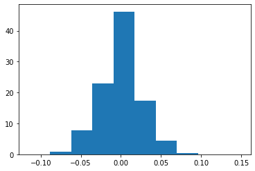
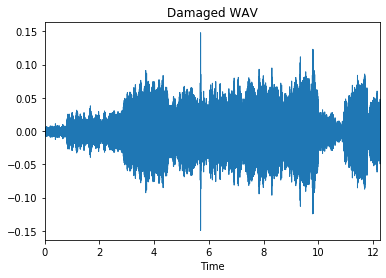
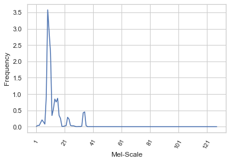
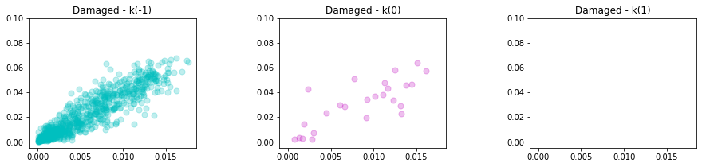
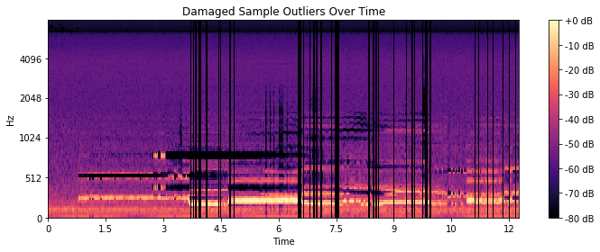
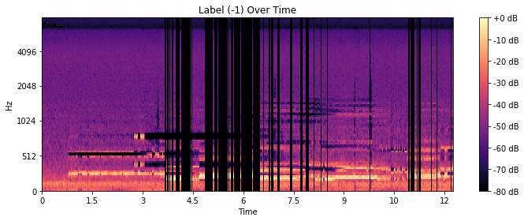

# Machine Learning Engineer Nanodegree
## Capstone Project
Carlos Rodriguez
August 2nd, 2019

## I. Definition

### Project Overview

Today, unearthing a rare audio archive can be as simple as accessing a popular video-sharing platform from a device that fits in your pocket. Alternatively, the fidelity of these aging recordings seemingly remains frozen in the time in which they were captured. Often, meaningful (and even critical) portions of these recordings are unintelligible and are lost to history.

The goal of this capstone is to experiment with using [imputation](https://en.wikipedia.org/wiki/Imputation_(statistics)) algorithms to restore portions of audio content that were recorded poorly or were lost due to degradation.

The occurrence of missing data is not uncommon in machine learning. Methods for imputation have been explored in-depth and for various applications, including [medical domains](https://www.ncbi.nlm.nih.gov/pmc/articles/PMC4959387/).

Matrix imputation has been applied to audio applications specifically in an attempt to impute missing values in the spectrogram as noted in this [research](https://ethman.github.io/063_1570360326.pdf) done by students at Northwestern University.

### Problem Statement

Restoring or repairing audio is challenging for many reasons. Some inherent challenges are working with damaged audio, including but not limited to:

- Isolation of the desired source signal
- Identifying and removing noise
- Partial or complete loss of data during recording or due to degradation

Restoring lost audio data is particularly problematic because the audio is generally not missing from the signal, but unintelligible for the listener. This solution would treat unintelligible sound as anomalous and explicitly encode those data points as missing data (null values). An imputation algorithm would then replace the missing data with a plausible replacement similar to its neighbors.

In practice, a final application will execute the following:

1. Load and normalize audio data
2. Deconstruct audio into features that best characterize the desired source signal (e.g., speech)
2. Reduce/remove background noise to isolate the most valuable auditory data
3. Partition the data into clusters separating typical data from atypical data
5. Remove, then replace atypical data with nearby normal data
6. Reconstruct audio signal from the repaired data

### Metrics

A silhouette score was used to analyze the repaired audio. The silhouette value is a measure of how similar an object is to its cluster (cohesion) compared to other groups (separation). The silhouette ranges from −1 to +1, where a high value indicates that the object is well matched to its cluster and poorly matched to neighboring clusters.

A mean silhouette coefficient over all samples that is closer to `+1` is valuable because it should indicate that the repaired audio has clearly defined clusters representing only the desired audio (e.g., a voice) and some naturally occurring background noise (e.g., the acoustics of a room). It would also describe the closeness of any imputed values to its neighbors.

## II. Analysis

### Data Exploration

Each audio sample selected included one or more sections of perceived damaged audio. For the purposed of this analysis, "damage" was understood as audio perceived as anything other than speech or naturally occurring ambient sound (e.g., rustling, pops, static).

The inputs for this analysis were loaded from Wav formatted audio files and can be characterized as follows:

1. One dimensional (single channel) linear pulse of consecutive floating-point values
1. 44,100 samples per second of audio
1. Each sample is a single scalar value representing the amplitude (loudness) of the sound wave in one channel of audio data

| shape | min | max | mean |
|----|----|----|----|
| `(540225,)` | `-0.11444092` | `0.14855957` | `5.238364e-07` |

More than 40% of the values in the clip were small pulses. Meaning, the majority of the audio was a steady stream of similar amplitude with the exception of a few abnormal spikes in the damaged sample. **(Fig.2)**.

**Fig. 1** A histogram of amplitudes



**Fig. 2** A wave plot of the damaged sample



Features were extracted leveraging a computed Mel-scaled spectrogram.

The Mel scale is a perceptual scale of pitches judged by listeners to be equal in distance from one another [1]. Mel was chosen for two reasons. The first being that the goal was to isolate and replace human perceived damaged portions of audio.

**Fig. 3** Feature extraction
```
librosa.feature.melspectrogram(y=y, sr=sr)
```

The extraction resulted in 128 features each indicating a frequency (over time) for each band of the scale.

| shape | min | max | mean |
|----|----|----|----|
| `(1056, 128)` | `1.690951e-07` | `38.245834` | `0.1245189` |

 The second reason for choosing Mel was more technical. Librosa's implementation of the Mel-scale features also includes an inverse transformation from features back to audio. Sonification of the solution's output was helpful for an "evaluation by ear," albeit subjective.

**Fig. 4** Feature inversion
```
librosa.feature.inverse.mel_to_audio(M, sr=sr, length=len(original)
```

### Exploratory Visualization

The first sample selected for analysis was of human vocals mixed with various distortions.

It could be observed that a broader range of frequencies was present in the first quartile of the Mel-scale bands which might have corresponded with pitches typically found in speech.

**Fig. 5** A mean of frequencies across the 128 Mel bands.



Separately, a side-by-side Mel-spectral visualization of the selected pair of inputs suggested the presence of auditory perceived damage. The areas in bright yellow represented speech and were vividly defined in the ground truth sample. Whereas, the damaged example was not as vivid and peaks of sound were present in windows of time that should have been silent (dark purple), as apparent in the ground truth example.

**Fig. 6** A side-by-side comparison of Mel spectrograms from the damaged and repaired samples respectively


Of course, in a real-world application, a repaired sample would not be available for these types of comparisons. A more objective analysis would include defining a *damaged* window of time as a statistical anomaly. Of course, this approach depended on the assumption that the sample had enough [perceived] normal audio to establish a baseline for comparison from within the sample itself.

To establish a baseline for the perceived normal audio, I looked more closely at the Mel features extracted from the samples. I first applied a simple masking technique [2] to isolate the more pertinent auditory data.

**Fig. 7** Separation of background and foreground information from a damaged sample


### Algorithms and Techniques

With the more critical information isolated, I could now use that as input into a clustering algorithm that would help distinguish between typical and atypical data.

[Finding Clusters with HDBSCAN](https://hdbscan.readthedocs.io/en/latest/)

HDBSCAN is a recent algorithm developed by some of the same people who write the original DBSCAN paper. Their goal was to allow for varying density clusters. The algorithm picked  varying density clusters based on cluster stability[3]

Intuitively, the expectation was to find only a few clusters of varying densities. HDBSCAN provides granular control in defining the smallest grouping size that should be considered a cluster. I set the `min_cluster_size` to the very minimum which would, in turn, surface the maximum amount of clusters. If my intuition were correct, the output would yield only two or three clusters representing the primary signal, the damaged signal, and potentially some remaining ambient noise.

[Outlier Detection with GLOSH](https://hdbscan.readthedocs.io/en/latest/outlier_detection.html)

GLOSH supports the notion of local outliers. Meaning, it can detect outliers that may be noticeably different from points in its local region. Detecting local outliers could be important when damaged audio falls closely on the Mel-scale relative to normal audio. The solution would look to impute values for outliers first before moving on to any secondary clusters.

[K-Nearest Neighbors for Imputation](https://github.com/eltonlaw/impyute/blob/master/impyute/imputation/cs/fast_knn.py)

The KNN algorithm uses 'feature similarity' to predict the values of any new data points. A new point is assigned a value based on how closely it resembles the points in the neighborhood. [4]

This particular [implementation](https://github.com/eltonlaw/impyute/blob/master/impyute/imputation/cs/fast_knn.py) uses a basic mean to impute missing values initially. The complete array is then used to construct a  [KDTree](https://docs.scipy.org/doc/scipy/reference/generated/scipy.spatial.KDTree.query.html). The KDTree is queried returning distances to the nearest neighbors. Missing values are assigned using the weighted average of `k` nearest neighbors [5]

### Benchmark

The benchmark model was to be produced using a simple *frequent value* imputation strategy. Missing values were to be replaced naively using the most frequent value of each column in which the missing values were located.

The resulting imputed array produced a silhouette score of ~`-0.5`.

|  | Silhouette Score | Optimal Clusters |
|-----|-----|-----|
| **Damaged** |`0.4332`| 3
| **Ground Truth** | `0.5319` | 3
| **Benchmark** | `-0.5472` | 3

Of course, the benchmark was only as good as the clustering analysis and outlier detection used to identify values that were to be imputed. Merely using a cross-sectional imputation of approach to re-value outliers (without any optimization to outlier detection) introduced a lot of noise and produced less well-defined clusters as compared to the original damaged sample.


## III. Methodology

### Data Preprocessing

Before performing any meaningful analysis of this data, various pre-processing steps were applied (`Pre-Processing` notebook).

**Normalized damaged and ground-truth inputs respectively for waveform length and array size**

  - Visual trimming of the waveforms with Audacity software to guarantee identical starting and stopping points

  - Explicitly setting a normalized duration when loading the Wav files into memory to guarantee identical input array size

**Applied a background noise filter to spectral input effectively to separate data points with less perceived auditory value**

  - filtering by nearest neighbors

  - applying the filter as a soft-mask

  - multiply the mask by the input spectrum to separate the input into the foreground and background components

### Implementation

Implementation of the solution could be described in a few major stages:

**Finding Clusters**

Before attempting to identify anomalous data in the damaged sample, I leveraged the ground-truth sample to establish expectations for normal clustering and outliers.

As a benchmark for clustering, partitions were first established with Kmeans. A custom search function (`search_param`) was utilized to find the optimal value for `k` with the expectation that the repaired sample should only produce `2` well-defined clusters with a silhouette score closer to one.

**Fig. 8** Results of ground-truth clustering with k-means


**Outlier Detection**

As described above the GLOSH algorithm was utilized to calculate outlier scores for ground-truth. Scoring was included as part of an implementation of HDBSCAN. The larger the score, the more outlier-like the point.[6] A visualization of the scoring was used as an aid in determining a threshold for outliers.

**Fig. 9** Results of ground-truth outlier detection with GLOSH


Surprisingly, in applying Clustering with HDBSCAN, it became apparent that the two algorithms produced very different results.

**Fig. 10** Clusters defined with HDBSCAN


**Fig. 11** Clusters defined with K-Means


Clustering with HDBSCAN did define clusters with varying density but did not score as well. Assuming that silhouette score (measuring cohesion and likeness) was a reasonable metric to compare across the two algorithms, K-means appeared to have outperformed its more modern counterpart. Although, because the clusters were less globular, I accepted that K-means might have misclassified some points and HDBSCAN likely provided the more accurate partitioning.

**Fig. 12** HDBSCAN Silhouette Score


Two unique concerns arose after clustering with HDBSCAN and detecting outliers with GLOSH.

1. An identical amount of outliers were identified between the damaged and ground-truth samples.
2. It was apparent that the time-steps where outliers were detected did not include the auditory anomalies in particular.

**Fig. 13** Time-steps containing outliers



As a result, I would look at two possible remedies.

1. Evaluating the imputation of secondary clusters instead of outliers
2. Utilizing a different set of auditory features

A visualization of the smaller cluster (-1 label) over time seem to align more cleanly with the time-steps that needed repair. This alignment might have been an indication that this particular cluster was a better representation of time-steps that included auditory damage. Since I didn't have a mathematical way of mapping data points within clusters directly to auditory damage, I experimented with the imputation of any secondary clusters, expecting that any sparser clusters were more likely to contain the time-steps with auditory damage.

**Fig. 14** Time-steps belonging to cluster with a label of `-1`



**Imputation**

To intentionally create missing data to be imputed, a value of `None` was assigned to any/all values found in the chosen cluster.

Once the values were reassigned, I leveraged the [impyute](https://impyute.readthedocs.io/en/master/) library to perform a cross-sectional imputation setting the mode to **most frequent**. This mode would substitute missing values with the most frequent of that column. In the case that there was a tie a random selection from the columns was made [7]

**Fig. 15** Spectrogram of the repaired sample using "Most Frequent."


With a benchmark established for imputation, I moved on to imputation with KNN (as described previously).

**Fig. 16** Spectrogram of the repaired sample using KNN


Finally, the resulting imputed data was again clustered after searching for optimal `K`. A final score was derived using a silhouette score.

### Refinement

An optimal clustering of our final repaired sample produced a silhouette score of `-0.480` which was at least nominally improved from the benchmark but not very good overall. I did speculate as to several reasons why, but at minimum, I wanted to explore enhancing the performance of the imputation algorithm itself.

To do so, I looked first at parameter tuning that might improve the querying of the underlying KDTree.

The following adjustments were applied:

1. Increasing the search distance around points
2. Increasing the number of neighbors to return

Adjustments to these parameters had minimal effect on the resulting silhouette score.

**Fig. 17** S-Score after adjustments


Tuning the imputation resulted in no improvement, possibly due to the lack of and normal data surrounding the time-steps identified during clustering. In other words, the clusters I chose to impute might have represented too much of the sample to impute with information from its neighbors successfully.

Apart from KNN, the most successful imputer by far was the MICE algorithm (Multivariate Imputation by Chained Equations). MICE uses a chained equation approach to perform multiple imputations across the different variables.

Since the Mel-scale produces 128 unique features, an algorithm optimized for multivariate imputation was better suited for the task.

With this in mind, I discovered another iterative and multivariate optimized (experimental) algorithm from Sklearn implemented in the `IterativeImputer` class. This approach models each feature with missing values as a function of other features and uses that estimate for imputation. It does so in an iterative fashion and then is repeated for `max_iter` imputation rounds. The results of the final imputation round are returned. [8]

## IV. Results

### Model Evaluation and Validation

Ultimately, the multivariate imputation using a round-robin approach produced the most improved results.

**Fig. 18** Results from iterative imputation


Processing a different audio selection further elucidated that the solution could not establish a direct correlation between statistical differences and auditory differences when interpreting the audio with Mel-scale features.

Ultimately, the question of robustness was evaluated, finding the Silhouette Score of the imputed output:

- The Clusterer did not reliably partition auditory differences

- After imputation, clusters from the validation sample did not reflect strong statistical similarity as compared to the original sample.

| | Best K | Silhouette Score |
|-----|-----|-----|
| **Original result** | 2 | -0.0971 |
| **Validation result** | 19 | -0.1310 |

For these reasons, the results proved that the model was not robust enough to be trusted when providing a new input with similar auditory characteristics.

### Justification

Although the final results were significantly better than the benchmark, the metric was only valuable in measuring the statistical closeness of the reconstructed data.

|  | Silhouette Score | Optimal Clusters |
|-----|-----|-----|
| **Damaged** |`0.4332`| 3
| **Ground Truth** | `0.5319` | 3
| **Benchmark** | `-0.5472` | 3
| **Final Solution** | `-0.0971` | 2

The problem went unsolved in that a direct quantitative connection could not be established between statistical similarity and auditory similarity.  

## V. Conclusion

### Free-Form Visualization

The most compelling evidence that clustering with Mel features was not finding auditory anomalies or damage was most apparent in the spectrograms below **(Fig. 14)**. I used a zero-constant imputation to visualize time steps that were to be imputed.

**Fig. 19** Failing to find auditory damage

 

The unnatural vertical stripes in **Fig. 19** represented the time steps that would be imputed across all of their respective features. Auditory damage could be perceived visually between ~5 and 7 seconds.

**Fig. 20** Clusters over time

 

The smaller of the two most significant clusters **(Fig 20)** only indirectly found some of the auditory damage, but those results were not repeatable with other inputs.

**Fig. 21** Alternate Input - Clusters over time
 

In **Fig. 22**, clustering failed to partition the damaged audio that occurred before the five-second mark.  

### Reflection

The eventual success of this methodology will depend on the following core expectations:

1. An input that has sufficient *normal* audio to provide to the estimator
1. Feature engineering resulting in a more accurate representation of auditory changes over time
2. Clustering that accurately partitions auditory differences
3. Multivariate imputation that is computationally efficient with high accuracy
4. Validation against various inputs that include a variety of auditory damage

Apart from uncovering a methodology that could work in the real world, there were also some complexities with engineering the solution.

1. Feature selection (for the sake of time) was limited to implementations that included methods for inversing spectral representation back to time-series audio.
2. Since a ground-truth sample would not be available in the wild, I could not leverage any programmatic comparisons to ground-truth. For example, an intersection of the two samples would have been useful in isolating windows of auditory damage.   

### Improvement

Overall, I do think this approach could yield real-world results if it could establish a direct quantitative relationship between statistical similarity and auditory similarity.

To find that link, I might start by experimenting with a different feature set. The selected features did not seem to sufficiently define the characteristics that represent normal audio (speech in this case). An auditory abnormality may be too similar (on the standard Mel-scale) to speech for a Clusterer to differentiate in a repeatable fashion.

For example, a better selection could be MFCC. Mel-frequency cepstral coefficients are frequency bands that are equally spaced on the Mel-scale and approximate the human auditory system's response more closely[9].

Secondly, I'd look at a more precise imputation strategy with deep-learning. I would expect a deep-learning approach to improve upon the success of the iterative multivariate imputation exponentially. A study focused on the imputation of genomic data, recorded some progress using a denoising autoencoder with partial loss (DAPL) as described in this [paper](https://www.biorxiv.org/content/10.1101/406066v2).

> "A denoising autoencoder (DAE) aims to recover the noise-free, original input through
deep networks given a noisy input (Vincent et al., 2008). In each iteration of training, noise is
added to the input X to obtain X hat. The loss is computed between the original X and the
reconstructed X hat).

> Denoising autoencoder with partial loss
When the added noise to DAE is in the form of masking noise, i.e., a random fraction of
the input is set to 0; the DAE can be trained to estimate missing values (Vincent et al., 2010).
The 0s in the training data simulate the missing elements, and the reconstructed noise-free data
will fill those positions with estimated values. "[10]

Lastly, I'd look to support the outcome with more validation metrics. For this project, I focused exclusively on the likeness of the data points and measuring that the imputed values fit neatly within their neighborhoods. I would also include a metric that measures the accuracy of the reconstruction by the estimator.  

### References

1. https://en.wikipedia.org/wiki/Mel_scale
2. https://librosa.github.io/librosa/0.7.0/auto_examples/plot_vocal_separation.html
3. https://hdbscan.readthedocs.io/en/latest/
4. https://towardsdatascience.com/6-different-ways-to-compensate-for-missing-values-data-imputation-with-examples-6022d9ca0779
5. https://github.com/eltonlaw/impyute/blob/master/impyute/imputation/cs/fast_knn.py
6. https://hdbscan.readthedocs.io/en/latest/api.html
7. https://impyute.readthedocs.io/en/latest/_modules/impyute/imputation/cs/central_tendency.html#mode
8. https://scikit-learn.org/stable/modules/impute.html
9. https://en.wikipedia.org/wiki/Mel-frequency_cepstrum
10. https://www.biorxiv.org/content/10.1101/406066v2
