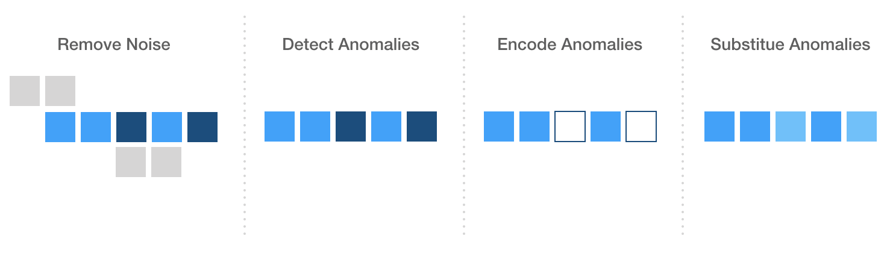

# Machine Learning Engineer Nanodegree
## Capstone Proposal
Carlos Rodriguez
June 22nd, 2019

## Proposal

### Domain Background

Today, unearthing a rare audio archive can be as simple as accessing a popular video sharing platform from a device that fits in your pocket. Alternatively, the fidelity of these aging recordings seemingly remains frozen in the time in which they were captured. Often, important (and even critical) portions of these recordings are unintelligible and are lost to history.

The goal of this capstone is to experiment with using [imputation](https://en.wikipedia.org/wiki/Imputation_(statistics)) algorithms to restore portions of audio content that were recorded poorly or were lost due to degradation.

### Problem Statement

Restoring or repairing audio is challenging for many reasons. There are some inherent challenges with working audio including but not limited to:

- Isolation of the desired source signal
- Identifying and removing noise
- Partial or complete loss of data during recording or due to degradation

Restoring lost audio data is particularly problematic because the audio is generally not missing from the signal, but unintelligible for the listener. This solution would treat unintelligible audio as anomalous and explicitly encode some data points as missing data (null values). An imputation algorithm would then replace the missing data with a plausible replacement similar to its neighbors.

### Datasets and Inputs

The solution will be applied to two recordings that have distinguishable audio degradation. Each selection has background noise, distortion, and some loss.  

Both damaged audio sources were also repaired using the industry-leading software. For each, only a small distinct sample of the damaged audio will be used, and a corresponding sample of the repaired audio will serve as ground truth.

*Spectral Repair with iZotope RX 2*
http://www.auldworks.com/articles/audiorestorenew2.htm

The goal of using two inputs is to validate that the technique can work generally across audio signals with similar characteristics.

### Solution Statement

This solution treats unintelligible audio as anomalous and explicitly encodes the data point as missing data (null value). An imputation algorithm will then replace the missing data point inserting a plausible value that is similar to its neighbors.

Noise and unwanted signal sources are cleaned as part of pre-processing. Any desired source audio that is audibly diminished during pre-processing is also replaced.

### Benchmark Model

As a benchmark, the outputs of the solution will be compared to the professionally repaired samples which will establish ground truth.

### Evaluation Metrics

To evaluate success, the solution will measure the mean Silhouette Coefficient (silhouette score). The output data should reflect an optimal value for `n_clusters` that is relatively small.  Since a silhouette analysis can be ambivalent in deciding between 2 and 4 clusters (1), the solution should also evaluate the size of the individual clusters.

Larger sized clusters should represent the desired source audio, while smaller clusters should represent naturally occurring noise and/or other less significant source audio.

The solution should hope to have a statistically similar score as compared to its benchmark, and exhibit nearly identical clustering, outliers, and anomalies.

### Project Design

In theory, the solution should sequentially accomplish these overarching tasks:

I. Noise removal with FFTT and/or DBSCAN
  - Fast Fourier Transform noise reduction could potentially aid in the removal of typical and expected noise frequencies.

  - DBSCAN might be a better overall solution because it may protect sections that are candidates for substitution.

   Points that are generally unreachable from other points can be considered noise and can be cleaned from the dataset. The threshold for noise should be high so as not to inadvertently remove data that can be substituted.

II. Anomaly Detection with DBSCAN
  - For the purpose of this solution, anomalies should be distinguishable from noise. Anomalous data points should display more connectedness to points that represent the desired source audio.

  To make this distinction, anomalous sections may require a separate analysis using audio-specific characteristics like Fourier properties.

III. Encoding of anomalous points as missing data, temporarily substituting with `None`

  - Once Identified, the solution will treat anomalies like missing data simply by replacing those points with null values (intended to resemble missing values in a structured data set).

IV. Replace missing data points leveraging K-Nearest Neighbors

  - The solution will then attempt to replace the missing values with statistically similar values as predicted using **KNN**.

  > "The assumption behind using KNN for missing values is that a point value can be approximated by the values of the points that are closest to it, based on other variables." (2)

Additional considerations that could alter this solution:
  - representing audio data in higher dimensions could me more informative, but presents challenges with this approach

**References**

1. https://scikit-learn.org/stable/auto_examples/cluster/plot_kmeans_silhouette_analysis.html

1. https://towardsdatascience.com/the-use-of-knn-for-missing-values-cf33d935c637

-----------
